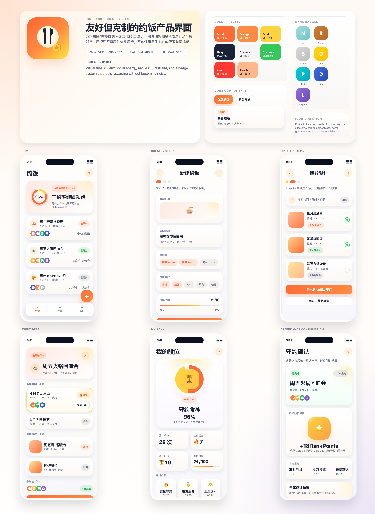

# DineRank / 食否 / Dinely

基于 SwiftUI 构建的 iOS 17+ 约饭协同 MVP，用来解决「和熟人约饭时，去哪吃、几点去、谁会准时、怎么 AA」这一整条链路的问题。

当前版本聚焦在两个核心方向：

- 熟人饭局协同：创建约饭、时间投票、餐厅投票、地图查看、签到确认、AA 分摊
- 守约段位机制：把参与、签到、守约、分享沉淀成可视化段位和战报卡

项目仓库名使用 `Dinely`，产品在中文区默认展示为 `食否`，英语区默认展示为 `Dinely`。

## 项目现状

这不是一个空的 iOS 模板工程，而是已经搭好首版业务骨架的 MVP：

- 三个主 Tab：`约饭`、`我的段位`、`设置`
- 首页饭局列表、Hero 区、状态徽标、基础卡片组件
- 创建约饭的多步流程和编辑流
- 饭局详情、时间/餐厅投票、参与人状态展示
- 当天地图、签到、AA、战报等后续流程入口
- Live Activity / Widget / App Group 基础设施
- 后台刷新、本地通知、分享链接解析骨架
- Pro 买断版商品与权益展示结构
- UI Test 烟雾测试骨架

## 体验截图



## 技术栈

- iOS 17+
- SwiftUI
- WidgetKit
- ActivityKit
- StoreKit 2
- BackgroundTasks
- MapKit
- App Group 共享存储

## 当前信息架构

### 1. 约饭

- 首页饭局列表
- 创建/编辑饭局
- 时间与餐厅投票
- 详情页与当天流程入口

### 2. 我的段位

- 段位 Hero
- 守约战绩
- 分享卡和排行榜骨架

### 3. 设置

- 主题与偏好设置
- Live Activity / 后台刷新开关
- Pro 权益展示
- 隐私、条款、免责声明和支持入口

## 代码结构

```text
.
├── DineRank/                     # App 主工程源码
│   ├── App/                      # App 入口与根导航
│   ├── Models/                   # 业务模型、配置模型、权益模型
│   ├── Resources/                # Assets、Info.plist、多语言资源
│   ├── Services/                 # 本地存储、通知、后台刷新、StoreKit、活动等服务
│   ├── Support/                  # 主题、格式化、配置、样例数据、运行时辅助
│   ├── ViewModels/               # 页面状态管理
│   └── Views/                    # 页面与通用组件
├── DineRankWidgetsExtension/     # Widget 扩展
├── DineRankUITests/              # UI 测试骨架
├── Deployment/                   # 审核、隐私、Universal Links 等交付资料
├── design-deliverables/          # 设计产物与导出稿
├── output/                       # Playwright 导出图片等辅助产物
└── scripts/                      # 工程辅助脚本
```

## 本地运行

### 使用 Xcode

1. 使用 Xcode 打开 `DineRank.xcodeproj`
2. 选择 `DineRank` scheme
3. 选择 iOS 17+ 模拟器或真机
4. 运行

### 使用命令行构建

```bash
xcodebuild -project DineRank.xcodeproj \
  -scheme DineRank \
  -destination 'generic/platform=iOS Simulator' \
  CODE_SIGNING_ALLOWED=NO \
  build
```

## 关键配置

核心配置集中在 `DineRank/Support/AppConfig.swift`：

- Bundle ID：`com.ricardo.dinerank`
- App Group：`group.com.ricardo.dinerank`
- CloudKit Container：`iCloud.com.ricardo.dinerank`
- Background Task ID：`com.ricardo.dinerank.refresh`
- URL Scheme：`dinerank`
- Universal Link Host：`dinerank.app`

同时项目内已经预埋了：

- 市场名切换：中文区显示 `食否`，英语区显示 `Dinely`
- Pro 买断商品 ID
- 隐私政策、支持页、EULA 等外链占位

## 当前哪些部分已经是“真页面”

- 主导航与三大主 Tab
- 首页内容组织和饭局列表
- 创建/编辑饭局流程
- 饭局详情页和核心流程入口
- 设置页、权益页、法律与支持入口

## 当前哪些部分仍是骨架/占位

- CloudKit 真实协作与线上 schema
- 餐厅搜索与线上接口
- Universal Link 线上域名联调
- 真实 IAP 商品上架与票据校验
- 真机定位、通知、Live Activity、Widget 联调
- 线上后端接口和容灾策略

## 建议下一步

1. 收口正式的 Bundle ID、域名、App Group 和 CloudKit 容器
2. 接通真实餐厅搜索与饭局同步接口
3. 完成分享链接、入局流程和多人协作状态同步
4. 完成 Pro 权益的真实商品配置与购买校验
5. 补齐真机场景下的定位、通知、Live Activity 和 Widget 联调

## 仓库内附带资料

- `Deployment/AppReview/`：审核说明、隐私政策网页文案、Review Notes 模板
- `Deployment/UniversalLinks/`：`apple-app-site-association` 与说明
- `产品与技术方案/`：产品方案、段位设计、可行性分析
- `design-deliverables/`：图标、Figma board、分享卡设计稿

## 说明

- 当前默认依赖 `SampleData` 和本地 Store，适合继续做 MVP 演进，不适合直接作为线上版交付。
- Widget、Live Activity、后台刷新、通知和定位能力需要真机签名后再做最终验证。
- 如果你准备继续沿这个仓库推进，优先把“真实配置”和“真实数据源”两件事先补齐。
